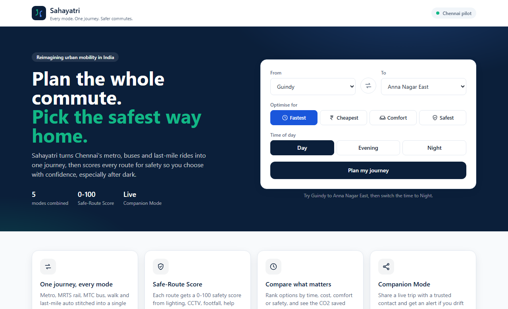
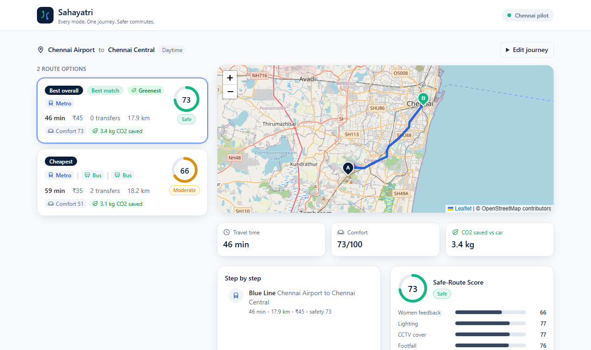
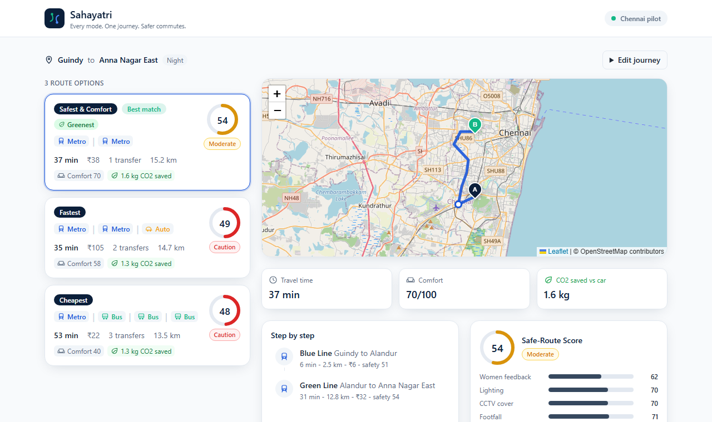

# Sahayatri

**Every mode. One journey. Safer commutes.**

Sahayatri is an AI multi-modal journey planner for Indian cities, built for the
**OneJourney Mobility Hackathon 2026** (theme: *Reimagining Urban Mobility &
Daily Commute in India*). It stitches Metro, MRTS rail, MTC bus and last-mile
rides into a single plan and scores every route for safety, so commuters -
especially women travelling after dark - can choose with confidence, not guesswork.

This repository is a working MVP for a **Chennai pilot**.



---

## The problem

A typical Chennai commute spans a walk, a bus, the metro and a last-mile auto -
and today that means juggling three or four apps that do not talk to each other.
None of them answer the question that actually matters at 9pm: *which of these
routes is the safest way home?* Safety is treated as an afterthought, never a
first-class input to the plan.

## The solution

Sahayatri makes safety a ranking dimension alongside time and cost:

- **One journey, every mode.** Metro, MRTS rail, bus, walk and auto combined into
  a single end-to-end plan with real routing, not five separate apps.
- **Ask in plain language.** Type *"cheapest safe way from Guindy to Anna Nagar
  after 9pm"* and the AI assistant fills in the stops, priority and time. It uses
  Gemini with a constrained schema, and falls back to an offline parser so it
  never blocks the demo.
- **Safe-Route Score (0-100).** Each route is scored from lighting, CCTV cover,
  footfall, help points and crowd-sourced women-safety feedback, then adjusted
  for the travel mode and the time of day.
- **Compare what matters.** Rank options by **Fastest**, **Cheapest**,
  **Comfort** or **Safest** and see the trade-off before stepping out.
- **Greener choices.** Every route shows the **CO2 saved versus driving**, and the
  lowest-emission option is flagged as the *Greenest*.
- **Companion Mode.** Share a live trip with a trusted contact and trigger an
  alert if you drift off the planned route.

| Daytime - a "Safe" metro route | Night - the same trip drops to "Caution" |
| --- | --- |
|  |  |

> The same Guindy to Anna Nagar metro route reads **Moderate** by day, while the
> auto and bus alternatives fall to **Caution** at night. That difference is the
> point.

---

## How the Safe-Route Score works

The score is a transparent, **explainable weighted model** - a deliberate choice,
because a safety number that riders and city partners must trust should be
auditable, not a black box.

For each leg:

```
legBase   = 0.30*womenFeedback + 0.22*lighting + 0.18*cctv + 0.15*footfall + 0.15*helpPoints
legScore  = legBase x modeFactor x timeFactor x 100
```

- **modeFactor** captures exposure: metro `1.0`, bus `0.86`, auto `0.72`, walk `0.6`.
- **timeFactor** compounds risk after dark: day `1.0`, evening `0.9`, night `0.8`.
- A route's score is the **time-weighted average** of its legs, so longer, riskier
  legs pull it down more. Bands: `>=72 Safe`, `>=52 Moderate`, else `Caution`.

### Where the weights come from

The deployed weights are **calibrated from data**, not hand-picked. `ml/safe_route_model.py`
builds a labelled dataset of route legs, recovers the linear weights the app ships,
and validates them against a Random Forest:

```bash
cd ml
pip install -r requirements.txt
python safe_route_model.py
```

```
Model validation
  Linear  R^2 0.787   MAE 3.20
  Forest  R^2 0.752   MAE 3.45

Calibrated Safe-Route Score weights
  feature           deployed   learned
  women_feedback        0.30     0.295
  lighting              0.22     0.220
  cctv                  0.18     0.185
  crowd                 0.15     0.150
  help_points           0.15     0.151
```

In production the training labels come from historical incident data plus
crowd-sourced women-safety feedback; here they are synthesised so the pipeline is
fully reproducible offline.

---

## Tech stack

- **Frontend / Backend:** Next.js 14 (App Router), React 18, TypeScript
- **Styling:** Tailwind CSS
- **Maps:** Leaflet + OpenStreetMap (no API key required)
- **Routing engine:** custom multi-modal graph + Dijkstra (TypeScript)
- **AI assistant:** Gemini (`gemini-2.5-flash`) with JSON schema output + offline fallback
- **ML calibration:** Python, scikit-learn, NumPy

## Architecture

```
Browser (React UI, Leaflet map)
        |
        v
Next.js App Router
  - /                home + journey form
  - /results         server-rendered route options + interactive view
  - /api/plan        REST endpoint (GET/POST)
  - /api/assistant   plain-language -> structured trip (Gemini + fallback)
        |
        v
Planning core (lib/)
  - data/chennai.ts  seeded transit graph (Metro, MRTS rail, bus, walk, auto) + safety zones
  - routing.ts       Dijkstra over the graph for fastest / cheapest / comfort / safest
  - safety.ts        Safe-Route Score engine
  - metrics.ts       comfort model + CO2 (vs car) calculation
  - assistant.ts     offline natural-language query parser (LLM fallback)
```

The UI and the `/api/plan` endpoint both call the same `planJourney()` core, so
there is a single source of truth and the API is ready for third-party
integration.

---

## Getting started

Requires **Node.js 18+**.

```bash
npm install
npm run dev
```

Open <http://localhost:3000>.

### AI assistant (optional)

The "Ask in plain language" box works out of the box using an offline parser. To
enable the Gemini-powered version, copy `.env.example` to `.env.local` and add a
key from [Google AI Studio](https://aistudio.google.com/app/apikey):

```bash
cp .env.example .env.local   # then set GEMINI_API_KEY
```

```bash
npm run build   # production build
npm run start   # serve the production build
```

### API

`GET /api/plan?from=guindy&to=annanagar_east&priority=safest&tod=night`

`POST /api/plan` with JSON `{ "fromId", "toId", "priority", "timeOfDay" }`

- `priority`: `fastest` | `cheapest` | `comfortable` | `safest`
- `timeOfDay`: `day` | `evening` | `night`

Returns ranked route options, each with legs, totals (time / cost / distance),
transfers and a Safe-Route Score with a per-factor breakdown.

`POST /api/assistant` with JSON `{ "query": "cheapest safe way from Guindy to Anna Nagar after 9pm" }`
returns `{ fromId, toId, priority, timeOfDay, source, understood }`, where
`source` is `gemini` or `rules` (offline fallback).

---

## Project structure

```
app/            Next.js routes (home, results, api/plan, api/assistant)
components/     UI: form, assistant box, route cards, map, safety meter, companion mode
lib/            data, types, routing engine, safety + comfort + CO2 engines, assistant, geo
ml/             scikit-learn weight calibration + validation
docs/           screenshots
```

## Roadmap

- Live GTFS / Metro + MTC feeds and real-time vehicle positions
- Trained Safe-Route model on real incident + feedback data, refreshed nightly
- Native Companion Mode with push alerts and one-tap SOS
- Expand beyond Chennai to other Indian metros

## Author

**Visshva R** - Team *Think Loop* (solo) - OneJourney Mobility Hackathon 2026.
