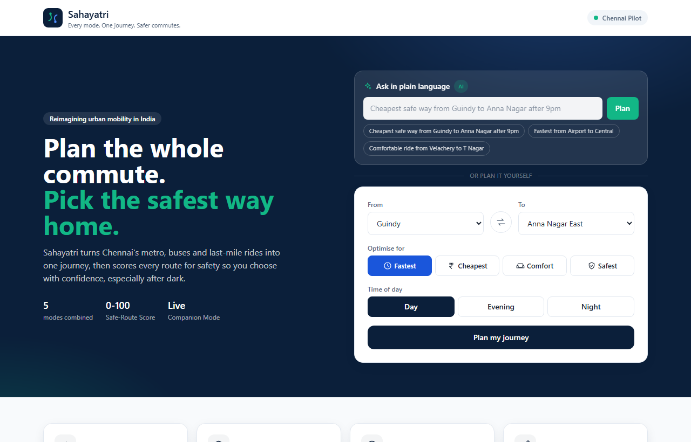
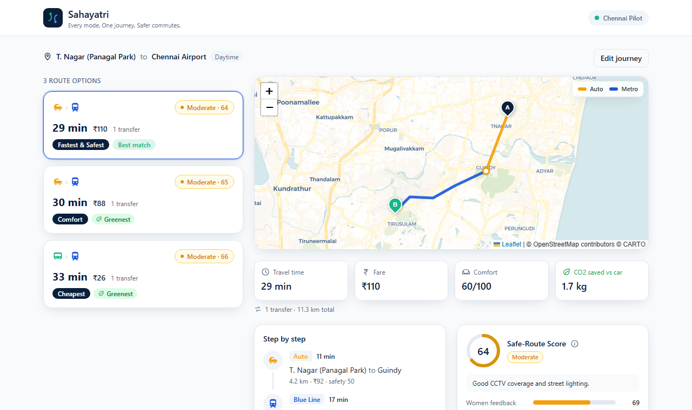
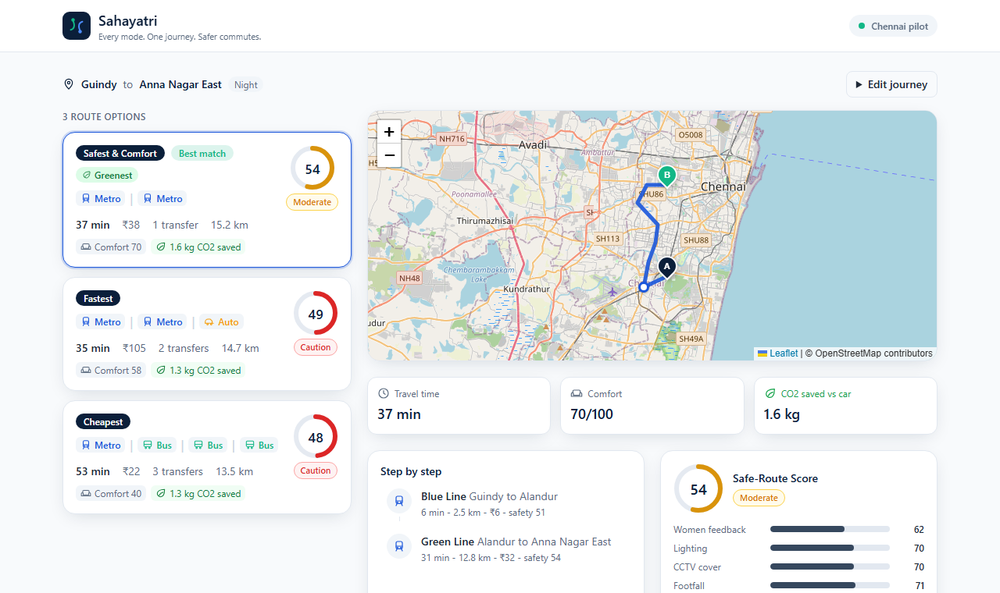

# Sahayatri

**Every mode. One journey. Safer commutes.**

Sahayatri is a Chennai multi-modal journey planner. It stitches Metro, MRTS, suburban rail, MTC bus, walk and last-mile auto into one itinerary, then scores every option with an **explainable Safe-Route Score** (0–100) so you can compare time, cost, comfort and safety — especially after dark.

**Live:** [https://sahayatri-chennai-commute.vercel.app](https://sahayatri-chennai-commute.vercel.app/)

This is a **frontend product**: React UI, client state, and a Leaflet map. Route options are computed in the same Next.js app from a **seeded Chennai network** (not a live transit feed). There is no live GPS, no emergency dispatch, and no model running in the request path. Gemini is optional for the plain-language box and is not required for the demo.



---

## What you can do

- **Plan origin → destination** across five modes, including short walks to the nearest station (e.g. Airport → Tirusulam suburban → Park → Central).
- **Compare 2–3 alternatives** side by side: door-to-door ETA, fare, Safe-Route Score, comfort, transfers, CO2 vs a car.
- **Read why a score is X** — factor cards with weights, evidence by corridor, mode exposure and time-of-day notes.
- **Share a trip status summary** (device share or copy). Companion mode is a **labelled demo walkthrough**, not live GPS.
- **Safety kit** — pre-trip checklist and public numbers (112, 1091). The app does not dispatch emergency services.
- **Ask in plain language** (optional Gemini) with a guaranteed offline parser.

| Daytime compare | Night safety drop |
| --- | --- |
|  |  |

---

## Demo commutes

From the home page, or open these paths:

| Preset | Journey | Why it is useful |
| --- | --- | --- |
| Office | Guindy → Anna Nagar East (day, fastest) | Metro vs bus tradeoffs |
| College | Velachery → T. Nagar (day, comfort) | MRTS + last mile |
| Airport | Airport → Central (day, fastest) | Metro vs suburban + walk |
| Late night | Guindy → Anna Nagar East (night, safest) | Same pair, safety-first |

---

## Demo script (~3 minutes)

1. Open the live URL. Tap **After 9pm → Late-night way home**.
2. Scan the route cards. Open **Compare** and point at time / fare / Safe-Route columns.
3. Back on **Routes**, open the Safe-Route panel: headline (“why this number”), then two or three **factor cards** (weight + evidence).
4. Expand **How it is scored** (info icon) and read the formula in one sentence.
5. Scroll **Step by step**: waits, via stops, transfer line.
6. **Share trip status** (copy). Show the safety kit — checklist + 112 / 1091, no fake SOS dispatch.
7. Optionally play **Companion briefing** and say out loud: simulated progress, not live GPS.
8. Home → **Ask in plain language**: `Cheapest safe way from Guindy to Anna Nagar after 9pm`. Works with or without `GEMINI_API_KEY`.

---

## How the Safe-Route Score works

Transparent weighted model — auditable, not a black box.

```
legBase  = 0.30*womenFeedback + 0.22*lighting + 0.18*cctv + 0.15*footfall + 0.15*helpPoints
legScore = legBase × modeFactor × timeFactor × 100
```

- **modeFactor:** metro `1.0`, rail `0.88`, bus `0.86`, auto `0.72`, walk `0.6`.
- **timeFactor:** day `1.0`, evening `0.9`, night `0.8`.
- Route score = **time-weighted average** of legs. Bands: `≥72 Safe`, `≥52 Moderate`, else `Caution`.

The numbers the UI shows are this weighted formula, computed before render. An offline notebook in `ml/` only checks that the weights are recoverable from a synthetic set. It is not part of the website.

```bash
cd ml
pip install -r requirements.txt
python safe_route_model.py
```

---

## Architecture

```
Browser
  Home (form, NL assistant, demo presets)
  Results (cards, compare, map, Safe-Route, share, safety kit)
        │
        ▼
Next.js App Router
  /                 planner
  /results          server-rendered options
  /api/plan         GET/POST planJourney
  /api/assistant    Gemini (7s timeout) → offline parseQueryLocal
        │
        ▼
lib/
  data/chennai.ts   seeded graph: Metro Blue/Green, MRTS, suburban spine,
                    MTC corridors, walk/auto transfers, safety zones
  routing.ts        transfer-aware Dijkstra, 4 objectives + rail/bus bias
  safety.ts         Safe-Route engine
  explain.ts        why-score + factor cards + compare insights
  eta.ts            boarding waits + clock labels
  metrics.ts        comfort + CO2 vs car
  assistant.ts      deterministic NL parser
  presets.ts        demo commutes
  share.ts          itinerary text (not GPS)
```

UI and `/api/plan` both call `planJourney()`. Same engine, one source of truth.

**Scale path:** replace the seeded graph with GTFS (CMRL, MTC, Southern Railway). Routing and scoring stay the same.

---

## Run locally

Requires **Node.js 18+**.

```bash
cd Project
npm install
cp .env.example .env.local   # optional: set GEMINI_API_KEY
npm run dev
```

Open [http://localhost:3000](http://localhost:3000).

```bash
npm run build
npm run start
```

### API

`GET /api/plan?from=guindy&to=annanagar_east&priority=safest&tod=night`

`POST /api/plan` `{ "fromId", "toId", "priority", "timeOfDay" }`

- `priority`: `fastest` | `cheapest` | `comfortable` | `safest`
- `timeOfDay`: `day` | `evening` | `night`

`POST /api/assistant` `{ "query": "..." }` → `{ fromId, toId, priority, timeOfDay, source, understood }`  
`source` is `gemini` or `rules`.

---

## Deploy (Vercel)

The app is Vercel-ready (Next.js 14, no custom server). Root Directory = repo root if this folder **is** the Git repo (as with [Sahayatri-Chennai-Commute](https://github.com/visshva-r/Sahayatri-Chennai-Commute)).

```bash
npm i -g vercel
cd Project
vercel          # preview
vercel --prod   # production
```

Or: [vercel.com](https://vercel.com) → Import GitHub repo → leave **Root Directory** as the folder that contains `package.json` → Deploy.

**Environment variables (optional):**

| Name | Value |
| --- | --- |
| `GEMINI_API_KEY` | Google AI Studio key |
| `GEMINI_MODEL` | `gemini-2.5-flash` |

Without them, production still plans routes and parses common phrases offline.

Redeploy after pushing: Vercel builds `main` automatically if the project is connected.

---

## Frontend notes

What is actually on screen, and how to talk about it:

1. **Journey state.** The results view keeps `selectedId` and a routes/compare toggle in React state. Selection resets only when the journey key changes (origin, destination, priority, time, or the set of plan ids) — not on every parent render.
2. **Derived selection.** The open route is `options.find(id) ?? options[0]`. Compare writes the same `selectedId`, then the map, steps, and score panel all read that one object.
3. **Map lifecycle.** Leaflet is loaded with `next/dynamic` and `ssr: false`. The map instance lives in a ref, is destroyed on unmount, and calls `invalidateSize` from a `ResizeObserver` so mobile rotation and the first layout do not leave a grey tile.
4. **Map gestures.** The route is fit once per path. A simulated companion dot updates without calling `fitBounds` again, so panning is not stolen. `touch-action: none` on the map container lets the finger drag the map instead of scrolling the page. The legend sits bottom-left, clear of the zoom control.
5. **Scoring UI.** The Safe-Route panel is a view of data already on the route: a headline, five factor cards (score, strong/ok/weak, weight, corridor evidence), and the time-of-day note. The info control only reveals the formula. Nothing in that panel calls a backend.

## Stack

- Next.js 14 (App Router), React 18, TypeScript
- Tailwind CSS
- Leaflet + CARTO / OpenStreetMap tiles (no map key)
- Seeded multi-modal graph + Dijkstra, run in the Next.js server for `/results` and `/api/plan` (same function the UI renders)
- Optional Gemini parse for the text box, with an offline fallback

---

## Honest limits

- Network is a **seeded Chennai slice**, not live GTFS or vehicle positions.
- Companion progress is a **simulation**. Share/copy is a real itinerary text, not a live tracker.
- Safety kit lists public numbers. **No emergency dispatch.**
- Fares and waits are typical, distance-based estimates.

---

## Author

**Visshva R**
